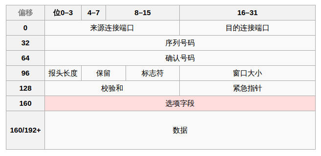

[TOC]

# 运输层协议

## 3.1 概述与约定

### 3.1.1 概述

+ 运输层协议为不同主机上的进程提供了**逻辑通信**功能
+ 运输层协议在端系统（主机）里实现 而不是路由器
+ 运输层中的分组(包)称之为**报文段**
+ 常见的运输层协议有TCP和UDP

### 3.1.2 运输层和网络层的关系

+ 拿送信做比方
  + 应用层报文 = 信封上的字符
  + 进程 = 发件人和收件人
  + 主机 = 发件人的家庭 收件人的家庭
  + 运输层协议 = 邮递员
  + 网络层协议 = 邮政服务

### 3.1.3 因特网中的运输层

#### 预备知识---IP协议

+ IP协议是一个网络层协议
+ IP的服务模型是“尽力而为”，但并不保证服务，是不可靠的
+ 每台主机有一个IP地址

#### TCP和UDP的责任

共有的：

+ **多路分解和多路复用** ：将主机间的交互转化为进程间的交互
+ **差错检查** ：通过报文段首部加入差错检查字段

TCP独有：

+ **可靠传输** ： 通过流量控制、序号、确认、定时器
+ **拥塞机制** ： 调节流量

## 3.3\2 多路复用机制

### 概述

+ 一个进程有一个或者多个套接字
+ 运输层实际上将数据交给了套接字们
+ 每个套接字都有唯一的标识符 并且标志了它是UDP还是TCP
+ 多路分解操作：在接收端，运输层协议检查报文头，读取接收套接字的信息，然后定向连接
+ 多路复用操作：在发送端，运输层协议从不同套接字收集信息，生成头部信息并打包

### 无连接的多路复用和多路分解

+ 运输层的报文包含应用程序数据、源端口号、目的端口号和其他两个值
+ 端口号是套接字的标志 一个UDP套接字由一个二元组构成，包含
  + 目的IP地址
  + 目的端口号
+ 只要目的IP和端口号一致，UDP报文就会被送到同一个套接字

### 面向连接的多路复用和多路分解

+ TCP套接字是一个四元组，包含：
  + 源IP
  + 源端口号
  + 目的IP
  + 目的端口号
+ 主机用套接字的全部四个值来分解，也就是说就算目的相同，源不同也不会分配到同个套接字，除非TCP报文段提供了初始连接的请求
+ 只有四个值都互相匹配，双方套接字才能互相发消息

### Web服务器和TCP

+ Web服务的默认端口是80
+ 对于持续HTTP，持续期间使用同一对套接字
+ 对于非持续HTTP，每一对请求/响应都创建一对套接字，再销毁
+ 套接字和进程不一定一一对应，因为有线程的存在

## 3.3 UDP协议：无连接运输

### 概述

+ UDP无非只是给网络层协议加上了一点多路复用/分解服务而已
+ web应用选择UDP服务，几乎无异于直接和IP打交道
+ UDP没有握手过程，是无连接的
+ DNS是使用UDP服务的典型范例，如果没有收到响应，则会向另一DNS服务器发请求，直到发现怎么都没有响应

### 优点

+ 关于何时、发送什么数据的应用层控制更加精细
+ 无需建立连接（握手）
+ 无连接：不需要在主机中维护连接状态
+ 分组首部仅仅8字节，而TCP需要20字节

### 应用层协议对应的运输层协议 

### 对比 

### UDP报文段结构

UDP报文的结构是32比特的头部，加上应用层报文

32比特平均分成4部分，包括源端口号，目的端口号，数据长度(首部+应用数据)，校验和

### UDP校验和

+ UDP校验和提供了**差错检测**功能，能检查链路层是否发生了比特改变
+ 发送方的UDP对报文段中所有16比特的字全部相加，再进行反码运算(溢出时回滚)
+ 虽然链路层也提供差错检测，但是不能保证所有链路都有提供
+ 虽然UDP有差错检测，但是它**没有任何纠错和恢复能力**，只能丢弃受损的报文，或者发出警告

## 3.4 可靠数据传输原理

### 3.4.0 概念和约定

+ 可靠数据传输协议是各种在传输上可靠的协议如`TCP`的总称
+ 本节我们将使用分组这个术语而不是运输层的称呼“报文段”，因为这里的理论适用于一般的计算机网络，而不仅仅是因特网运输层
+ 本节只讨论**单向可靠数据传输**，**双向可靠数据传输（全双工数据传输）**可以类推。

### 3.4.1 构造可靠数据传输协议

这部分暂且略过

### 3.4.2 可靠传输的各种机制

包括：

+ 差错检测（校验和）
+ 重传和定时器
+ 累计确认（ACK）
+ 序号和确认号

## 3.5 TCP协议

### 3.5.1 TCP连接约定

+ TCP在端系统上运行和保存状态，而不是在中间的网络元素如路由器和链路层交换机运行，所以它们不会维持TCP的连接状态。它们只能看到数据报而不是连接。
+ TCP提供全双工服务，点对点连接，但是不支持广播。

### 3.5.2 TCP连接的建立过程

通常是由一端打开一个套接字（socket）然后监听来自另一方的连接，这就是通常所指的被动打开（passive open）。服务器端被被动打开以后，用户端就能开始创建主动打开（active open）。

1. 客户端先发送一个特殊的TCP报文段`SYN` ，客户端把这段连接的序号设定为随机数**A**。
2. 服务器用另一个特殊的TCP报文段`SYN/ACK`响应，ACK的确认码应为**A+1**，`SYN/ACK`包本身又有一个随机序号**B**。
3. 客户端用第三个特殊的报文段`ACK`响应，当服务端受到这个ACK的时候，就完成了三次握手，并进入了连接创建状态。此时包序号被设定为收到的确认号**A+1**，而响应则为**B+1**。

以上三步称之为TCP的三次握手，只有第三个报文段可以承载有效负荷（应用层数据）。

### 3.5.3 TCP连接发送数据的过程

1. 客户端将数据送往`socket`
2. TCP将数据引导到发送缓存里
3. TCP会时不时从缓存中取出一块数据
   + 这块数据的大小限制于`MSS`(最大应用层报文段长度)
   + `MSS`由发送主机的`MTU`(最大链路层帧长度)决定
   + 以太网和`PPP`链路层协议都是1500字节的`MTU`，所以`MSS`的典型大小是1460字节
4. TCP为每块数据加上一个TCP首部，形成多个TCP报文段，下放给网络层
5. 另一端的TCP收到之后，放到接收缓存里
6. 应用程序通过套接字从接收缓存里读取数据

### 3.5.4 保证TCP的可靠性

在TCP的数据传送状态，很多重要的机制保证了TCP的可靠性和强壮性。它们包括：

+ 使用序号，对收到的TCP报文段进行排序以及检测重复的数据
+ 使用校验和来检测报文段的错误
+ 使用确认和计时器来检测和纠正丢包或延时

#### 序列号和确认

​	在TCP的连接创建状态，两个主机的TCP层间要交换*初始序号*（ISN：initial sequence number）。这些序号用于标识字节流中的数据，并且还是对应用层的数据字节进行记数的整数。通常在每个TCP报文段中都有一对序号和确认号。**TCP报文发送者认为自己的字节编号为序号，而认为接收者的字节编号为确认号。TCP报文的接收者为了确保可靠性，在接收到一定数量的连续字节流后才发送确认。**这是对TCP的一种扩展，通常称为选择确认（Selective Acknowledgement）。选择确认使得TCP接收者可以对乱序到达的数据块进行确认。每一个字节传输过后，ISN号都会递增1。

​	通过使用序号和确认号，TCP层可以把收到的报文段中的字节按**正确的顺序**交付给应用层。序号是32位的无符号数，在它增大到232-1时，便会回绕到0。对于ISN的选择是TCP中关键的一个操作，它可以确保强壮性和安全性。

#### 数据传输举例

1. 发送方首先发送第一个包含序列号为1（可变化）和1460字节数据的TCP报文段给接收方。接收方以一个没有数据的TCP报文段来回复（只含报头），用确认号1461来表示已完全收到并请求下一个报文段。
2. 发送方然后发送第二个包含序列号为1461和1460字节数据的TCP报文段给接收方。正常情况下，接收方以一个没有数据的TCP报文段来回复，用确认号2921（1461+1460）来表示已完全收到并请求下一个报文段。发送接收这样继续下去。
3. 然而当这些数据包都是相连的情况下，接收方没有必要每一次都回应。比如，他收到第1到5条TCP报文段，只需回应第五条就行了。在例子中第3条TCP报文段被丢失了，所以尽管他收到了第4和5条，然而他只能回应第2条。
4. 发送方在发送了第三条以后，没能收到回应，因此当时钟（timer）过时（expire）时，他重发第三条。（每次发送者发送一条TCP报文段后，都会再次启动一次时钟：RTT）。
5. 这次第三条被成功接收，接收方可以直接确认第5条，因为4，5两条已收到。

#### 校验和

TCP的16位的校验和（checksum）的计算和检验过程如下：

1. 发送者将TCP报文段的头部和数据部分的和计算出来
2. 再对其求反码，就得到了校验和，
3. 然后将结果装入报文中传输。（这里用反码和的原因是这种方法的循环进位使校验和可以在16位、32位、64位等情况下的计算结果再叠加后相同）
4. 接收者在收到报文后再按相同的算法计算一次校验和。这里使用的反码使得接收者不用再将校验和字段保存起来后清零，而可以直接将报文段连同校验加总。
5. 如果计算结果是全部为一，那么就表示了报文的完整性和正确性。
6. 注意：TCP校验和也包括了96位的伪头部，其中有源地址、目的地址、协议以及TCP的长度。这可以避免报文被错误地路由。

按现在的标准，**TCP的校验和是一个比较脆弱的校验**。出错概率高的数据链路层需要更高的能力来探测和纠正连接错误。TCP如果是在今天设计的，它很可能有一个32位的CRC校验来纠错，而不是使用校验和。但是通过在第二层使用通常的CRC校验或更完全一点的校验可以部分地弥补这种脆弱的校验。第二层是在TCP层和IP层之下的，比如PPP或以太网，它们使用了这些校验。但是这也并不意味着TCP的16位校验和是冗余的，对于因特网传输的观察，表明在受CRC校验保护的各跳之间，软件和硬件的错误通常也会在报文中引入错误，而端到端的TCP校验能够捕捉到很多的这种错误。这就是应用中的**端到端原则**。

#### 流量控制和阻塞管理

流量控制用来避免主机分组发送得过快而使接收方来不及完全收下。

### 3.5.5 终结通路

连接终止使用了四路握手过程，在这个过程中每个终端的连接都能独立地被终止。因此，一个典型的拆接过程需要每个终端都提供一对FIN和ACK。

### 3.5.6 状态编码

下表为TCP状态码列表，以**S**指代服务器，**C**指代客户端，**S&C**表示两者，**S/C**表示两者之一

- LISTEN S

  等待从任意远程TCP端口的连接请求。侦听状态。

- SYN-SENT C

  在发送连接请求后等待匹配的连接请求。通过connect()函数向服务器发出一个同步（SYNC）信号后进入此状态。

- SYN-RECEIVED S

  已经收到并发送同步（SYNC）信号之后等待确认（ACK）请求。

- ESTABLISHED S&C

  连接已经打开，收到的数据可以发送给用户。数据传输步骤的正常情况。此时连接两端是平等的。

- FIN-WAIT-1 S&C

  主动关闭端调用close（）函数发出FIN请求包，表示本方的数据发送全部结束，等待TCP连接另一端的确认包或FIN请求包。

- FIN-WAIT-2 S&C

  主动关闭端在FIN-WAIT-1状态下收到确认包，进入等待远程TCP的连接终止请求的半关闭状态。这时可以接收数据，但不再发送数据。

- CLOSE-WAIT S&C

  被动关闭端接到FIN后，就发出ACK以回应FIN请求，并进入等待本地用户的连接终止请求的半关闭状态。这时可以发送数据，但不再接收数据。

- CLOSING S&C

  在发出FIN后，又收到对方发来的FIN后，进入等待对方对连接终止（FIN）的确认（ACK）的状态。少见。

- LAST-ACK S&C

  被动关闭端全部数据发送完成之后，向主动关闭端发送FIN，进入等待确认包的状态。

- TIME-WAIT S/C

  主动关闭端接收到FIN后，就发送ACK包，等待足够时间以确保被动关闭端收到了终止请求的确认包。 
  【按照RFC 793，一个连接可以在TIME-WAIT保证最大四分钟，即[最大分段寿命](https://zh.wikipedia.org/wiki/%E6%9C%80%E5%A4%A7%E5%88%86%E6%AE%B5%E5%AF%BF%E5%91%BD)（maximum segment lifetime）的2倍】

- CLOSED S&C

  完全没有连接。

### 3.5.7 TCP数据包结构

 

- TCP报文段首部是20字节，比UDP首部多12字节
- 应用层协议通常采用长度小于MSS的数据块，典型的如telnet，数据块大小只有1字节，加起来21字节，首部是数据块的20倍大小
- 来源连接端口（16位长）－辨识发送连接端口号
- 目的连接端口（16位长）－辨识接收连接端口号
- 序列号（seq，32位长）
  - 如果含有同步化旗标（SYN），则此为最初的序列号；第一个数据比特的序列码为本序列号加一。
  - 如果没有同步化旗标（SYN），则此为第一个数据比特的序列码。
- 确认号（ack，32位长）—期望收到的数据的开始序列号。也即已经收到的数据的字节长度加1。
- 报头长度（4位长）—以4字节为单位计算出的数据段开始地址的偏移值。由于TCP选项字段的原因，TCP首部的长度是不定长的，通常选项字段为空，这时是20字节。
- 保留—须置0
- 标志符
  - URG—为1表示高优先级数据包，紧急指针字段有效。
  - ACK—为1表示确认号字段有效
  - PSH—为1表示是带有PUSH标志的数据，指示接收方应该尽快将这个报文段交给应用层而不用等待缓冲区装满。
  - RST—为1表示出现严重差错。可能需要重现创建TCP连接。还可以用于拒绝非法的报文段和拒绝连接请求。
  - SYN—为1表示这是连接请求或是连接接受请求，用于创建连接和使顺序号同步
  - FIN—为1表示发送方没有数据要传输了，要求释放连接。
- 窗口（WIN，16位长）—表示从确认号开始，本报文的源方可以接收的字节数，即源方接收窗口大小。用于流量控制。
- 校验和（Checksum，16位长）—对整个的TCP报文段，包括TCP头部和TCP数据，以16位字进行计算所得。这是一个强制性的字段。
- 紧急指针（16位长）—本报文段中的紧急数据的最后一个字节的序号。
- 选项字段—最多40字节。每个选项的开始是1字节的kind字段，说明选项的类型。
  - 0：选项表结束（1字节）
  - 1：无操作（1字节）用于选项字段之间的字边界对齐。
  - 2：最大报文段长度（4字节，Maximum Segment Size，MSS）通常在创建连接而设置SYN标志的数据包中指明这个选项，指明本端所能接收的最大长度的报文段。通常将MSS设置为（MTU-40）字节，携带TCP报文段的IP数据报的长度就不会超过MTU，从而避免本机发生IP分片。只能出现在同步报文段中，否则将被忽略。
  - 3：窗口扩大因子（4字节，wscale），取值0-14。用来把TCP的窗口的值左移的位数。只能出现在同步报文段中，否则将被忽略。这是因为现在的TCP接收数据缓冲区（接收窗口）的长度通常大于65535字节。
  - 4：sackOK—发送端支持并同意使用SACK选项。
  - 5：SACK实际工作的选项。
  - 8：时间戳（10字节，TCP Timestamps Option，TSopt）
    - 发送端的时间戳（Timestamp Value field，TSval，4字节）
    - 时间戳回显应答（Timestamp Echo Reply field，TSecr，4字节）

### 3.5.8 拥塞控制

#### 概念

+ 拥塞控制是一种用来调整传输控制协议（TCP）连接单次发送的分组数量（单次发送量，在英文文献和程序代码中常叫做cwnd）的算法。
+ 它通过增减单次发送量逐步调整，使之逼近当前网络的承载量。如果单次发送量为1，此协议就退化为**停等协议**。
+ 单次发送量是以字节来做单位的。但是如果假设TCP每次传输都是按照最大报文段来发送数据的，那么也可以把数据包个数当作单次发送量的单位，所以有时我们说单次发送量增加1也就是增加相当于1个最大报文段的字节数

#### 算法

+ 拥塞控制假设[分组](https://zh.wikipedia.org/wiki/%E5%88%86%E7%BB%84)的丢失都是由网络繁忙造成的。拥塞控制有三种动作，分别对应主机感受到的情况：
  1. 收到一条**新确认**。这很好，表明当前的单次发送量小于网络的承载量。
  2. 收到三条对同一分组的确认，即**三条重复的确认**。单次发送量往往大于3，例如发送序号为0、10、20、30、40的5条长度为10字节的分组，其中序号20的丢了，则返回的确认是10、20、20、20。3个20就是重复的确认。
  3. 对某一条分组的确认迟迟未到，即**超时**。例如发送序号为0、10、20、30、40的5条长度为10字节的分组，其中序号30的丢了，则返回的确认是10、20、30、30。这才只有两条重复确认。然而刚刚说过，单次发送量往往大于3，所以超时更可能是因为不止一条分组或确认丢失而引起的，这说明网络比上一情况中的更加繁忙。
+ 当主机收到一条新确认，此时可以增加单次发送量。若当前单次发送量小于**倍增阈限**（在英文文献和程序代码中常叫做ssthresh），则单次发送量加倍（乘以2），即**指数增长**；否则单次发送量加1，即**线性增长**。
+ 当主机收到三条重复的确认——单次发送量减半，倍增阈限等于单次发送量。（进入线性增长期）
+ 当主机探测到超时——倍增阈限=单次发送量÷2，单次发送量=1。
