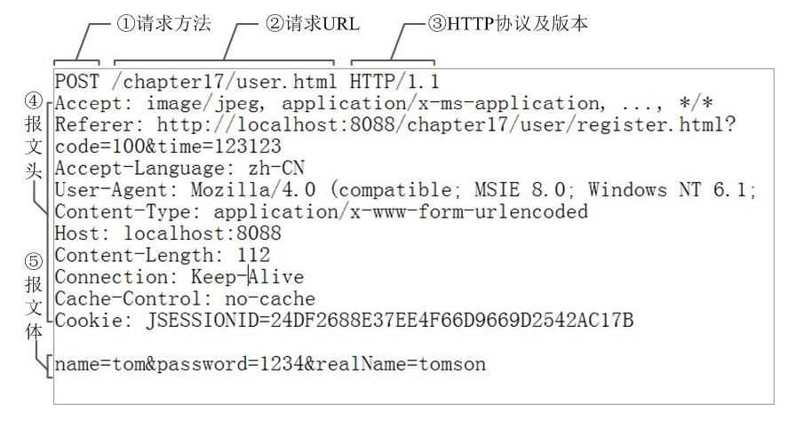

# 应用层协议

## 应用层协议的结构与分类应用

+ 应用程序体系结构包括**客户端-服务器架构**和**P2P体系结构**
+ 客户端-服务器架构
	* 发起通信的进程叫客户
	* 等待联系的进程叫服务器
	* 发送和接受报文的接口叫套接字
	* 通过IP来寻得主机，端口号区分主机上的不同应用程序

## 因特网提供的运输服务

### 因特网应用需求

### TCP服务
#### 特点
1. **面向连接**：发送报文之前经过三次握手，然后建立一条**全双工**连接，发送报文，再销毁连接
2. **可靠**：非常可靠，没有字节丢失和冗余
3. **有拥塞机制**：不一定给自己带来好处，但对整个网络环境友好
4. `TCP`不安全，但有自己的加强版——`SSL`协议

### UDP服务
#### 特点
1. **轻量级**：最小化服务，最小化成本
2. 不可靠：可能发送包丢失和乱序
3. **没有拥塞机制**：可以以任何速率向网络层注入数据

### 注意
不管是`UDP`还是`TCP`，都不提供弹性带宽（吞吐量）保证和时间敏感保证。

### 对比

### 应用层支持的运输层表

## HTTP协议

### 一些web术语和基本概念、约定

+ web文档是由对象组成的。一个对象就是一个文件。对象一般由`URL`来定位。
+ URL：统一资源定位符，主要由两部分组成：一部分是主机名，另一部分是对象们的路径名，是因特网上标准的资源的地址

### HTTP概况
+ `HTTP`一般使用`TCP`作为传输层协议（但HTTP协议中并没有规定必须使用它或它支持的层）
+ `HTTP`是一个无状态协议：`HTTP`服务器不保存客户的任何信息

### HTTP非持久连接
+ `HTTP` 0.9和1.0使用非持续连接
+ 在非持续连接下每个tcp只连接一个web对象，连接在每个请求回应对后都会关闭

### HTTP持久连接
+ `HTTP` 1.1+默认使用持续连接 1.0要加`Keep-alive`相应头
+ 一个连接可被多个请求重复利用的保持连接机制被引入，显著地减少了请求延迟，因为客户不用在首次请求后再次进行TCP交互确认创建连接
+ 优点
	* 较少的CPU和内存的使用（由于同时打开的连接的减少了）
	* 允许请求和应答的HTTP管线化
	* 降低网络阻塞 （TCP连接减少了）
	* 减少了后续请求的延迟（无需再进行握手）
	* 报告错误无需关闭TCP连接
+ 缺点
	* 对于现在的广泛普及的宽带连接来说，Keep-Alive也许并不像以前一样有用。web服务器会保持连接若干秒(Apache中默认15秒)，这与提高的性能相比也许会影响性能。
	* 对于单个文件被不断请求的服务(例如图片存放网站)，Keep-Alive可能会极大的影响性能，因为它在文件被请求之后还保持了不必要的连接很长时间。

### HTTP报文格式

#### 请求报文
以下是一个典型的请求报文

可以解析为

